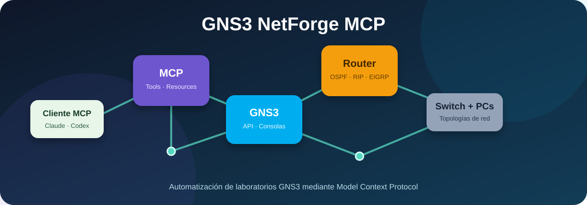
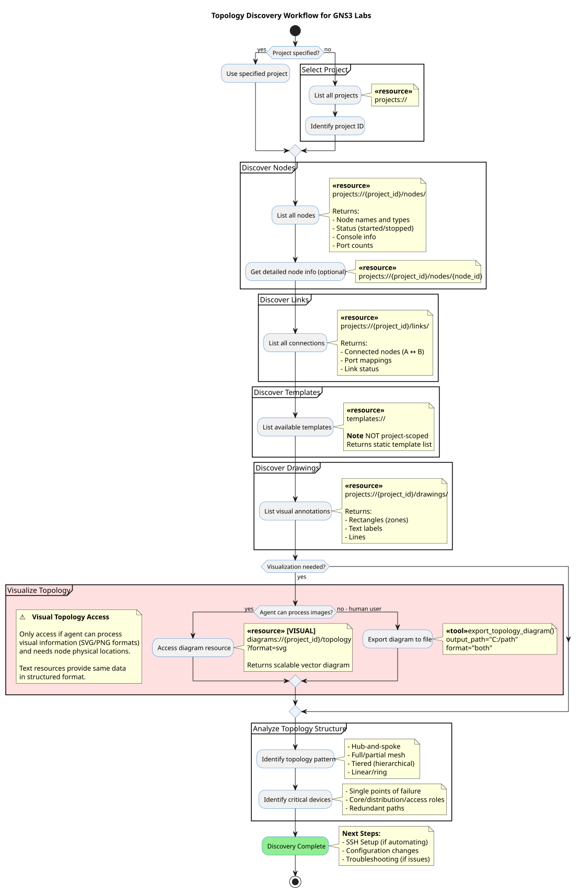

# GNS3 NetForge MCP

Servidor **Model Context Protocol (MCP)** para automatizar laboratorios de red en GNS3. Permite administrar proyectos, routers, switches, VPCS, máquinas virtuales, enlaces y consolas desde ChatGPT mediante una aplicación MCP personalizada.

  

## Funciones principales

- Crear, abrir, cerrar y consultar proyectos de GNS3.
- Crear, iniciar, detener y reiniciar nodos.
- Crear y eliminar enlaces entre dispositivos.
- Ejecutar comandos en consolas Telnet y SSH.
- Automatizar routers, switches, VPCS y máquinas virtuales.
- Consultar topologías, enlaces, sesiones y reportes.
- Ejecutar operaciones por lotes y trabajar con Docker.
- Usar autenticación por API Key en modo HTTP.

## Arquitectura

~~~text
Cliente MCP → GNS3 NetForge MCP → API de GNS3 → Routers, switches, VPCS y máquinas virtuales
~~~

  

Para consultar el flujo completo de creación de laboratorios, revisa [lab_setup_workflow.svg](mcp-server/docs/diagrams/lab_setup_workflow.svg).

## Requisitos

- Windows 10/11, Linux o macOS.
- Python 3.10 o superior.
- GNS3 Server instalado, encendido y accesible.
- Una cuenta de ChatGPT con acceso al modo de desarrollador y aplicaciones MCP personalizadas.
- Un endpoint HTTP/HTTPS accesible por ChatGPT.

## Preparar el servidor para ChatGPT

Instala las dependencias:

~~~powershell
pip install -e .
~~~

Inicia el servidor MCP en modo HTTP. Cambia los valores por los datos de tu servidor GNS3:

~~~powershell
gns3-mcp --transport http --http-host 0.0.0.0 --http-port 8000
~~~

Comprueba el servicio:

~~~powershell
curl http://localhost:8000/health
~~~

## Instalación desde el código fuente

~~~powershell
git clone https://github.com/Arminfx7/gns3-netforge-mcp.git
cd gns3-netforge-mcp
python -m venv .venv
.\\.venv\\Scripts\\Activate.ps1
python -m pip install --upgrade pip
pip install -e .
~~~

Después inicia el servidor en modo HTTP con el comando indicado en la sección anterior.

## Variables de configuración

Puedes usar un archivo .env basado en la plantilla:

~~~powershell
Copy-Item .env.example .env
notepad .env
~~~

| Variable | Obligatoria | Ejemplo | Descripción |
|---|---:|---|---|
| GNS3_HOST | Sí | 192.168.1.20 | IP o nombre del servidor GNS3 |
| GNS3_PORT | No | 80 | Puerto de la API de GNS3 |
| GNS3_USER | Sí | admin | Usuario de GNS3 |
| GNS3_PASSWORD | Sí | tu-contrasena | Contraseña de GNS3 |
| GNS3_USE_HTTPS | No | false | Activa HTTPS |
| GNS3_VERIFY_SSL | No | true | Verifica el certificado SSL |
| LOG_LEVEL | No | INFO | Nivel de registro |

Nunca publiques un archivo .env ni contraseñas reales.

## Configuración en ChatGPT

ChatGPT utiliza servidores MCP remotos. Si el servidor está en tu computadora o en una red privada, debes publicarlo mediante HTTPS o utilizar un túnel MCP seguro; ChatGPT no se conecta directamente a un servidor local sin ese mecanismo.

En ChatGPT web:

1. Abre **Configuración** y entra a **Aplicaciones** o **Aplicaciones conectadas**.
2. Activa **Modo de desarrollador** si tu plan y espacio de trabajo lo permiten.
3. Selecciona **Crear aplicación** o **Crear conector MCP personalizado**.
4. Escribe un nombre, por ejemplo **GNS3 NetForge MCP**.
5. Introduce la URL HTTPS de tu servidor MCP, por ejemplo `https://tu-dominio.example/mcp`.
6. Selecciona el método de autenticación que hayas configurado.
7. Pulsa **Scan Tools**, verifica las herramientas y selecciona **Create**.
8. Abre un chat nuevo, selecciona la aplicación MCP desde el menú de herramientas y prueba una solicitud como: “Muestra los proyectos disponibles en GNS3”.

La guía oficial se encuentra en [Modo de desarrollador y aplicaciones MCP en ChatGPT](https://help.openai.com/es-419/articles/12584461-developer-mode-and-mcp-apps-in-chatgpt).

### Variables para el servidor HTTP

~~~powershell
$env:GNS3_HOST="192.168.1.20"
$env:GNS3_PORT="80"
$env:GNS3_USER="admin"
$env:GNS3_PASSWORD="tu-contrasena"
gns3-mcp --transport http --http-host 0.0.0.0 --http-port 8000
~~~

No publiques directamente el puerto sin protección. Usa HTTPS, autenticación y un túnel seguro cuando el servidor se encuentre en una red privada.

## Uso desde ChatGPT

Después de agregar la aplicación MCP, puedes pedirle a ChatGPT:

- “Lista los proyectos de GNS3 disponibles”.
- “Muestra la topología del proyecto actual”.
- “Inicia los routers R1 y R2”.
- “Conecta estos dos dispositivos y verifica el enlace”.
- “Abre la consola de R1 y ejecuta show ip interface brief”.

Para acciones que cambien la topología o ejecuten comandos, revisa la confirmación que muestre ChatGPT antes de aceptarla.

<!-- La configuración JSON siguiente se conserva como referencia para otros clientes MCP. -->

### Configuración para otros clientes MCP

~~~json
{
  "mcpServers": {
    "gns3-mcp": {
      "command": "uvx",
      "args": ["gns3-mcp@latest"],
      "env": {
        "GNS3_HOST": "192.168.1.20",
        "GNS3_PORT": "80",
        "GNS3_USER": "admin",
        "GNS3_PASSWORD": "tu-contrasena"
      }
    }
  }
}
~~~

Reinicia el cliente MCP después de guardar el archivo.

## Modo HTTP

~~~powershell
$env:GNS3_HOST="192.168.1.20"
$env:GNS3_PORT="80"
$env:GNS3_USER="admin"
$env:GNS3_PASSWORD="tu-contrasena"
gns3-mcp --transport http --host 0.0.0.0 --port 8000
~~~

Comprueba el servicio:

~~~powershell
curl http://localhost:8000/health
~~~

## Docker

Requisitos: Docker Desktop y acceso de red al servidor GNS3.

~~~powershell
Copy-Item .env.example .env
docker compose up -d
docker compose logs -f
~~~

Para detener los contenedores:

~~~powershell
docker compose down
~~~

## Desarrollo y pruebas

~~~powershell
pip install -e ".[dev]"
python -m pytest
ruff check .
~~~

## Solución de problemas

Si no conecta con GNS3:

1. Confirma que GNS3 Server esté encendido.
2. Comprueba la IP, el puerto y las credenciales.
3. Verifica el firewall.
4. Prueba la API:

~~~powershell
curl http://192.168.1.20:80/v3/version
~~~

Si ChatGPT no muestra la aplicación MCP:

~~~text
1. Verifica que el endpoint HTTPS sea accesible desde Internet o desde el túnel MCP seguro.
2. Ejecuta nuevamente **Scan Tools** en la configuración de la aplicación.
3. Comprueba que el servidor responda en `/health`.
4. Revisa la autenticación y los permisos de las herramientas.
~~~

Para problemas con Docker:

~~~powershell
docker compose ps
docker compose logs gns3-mcp
docker compose restart
~~~

## Documentación adicional

- [DEPLOYMENT.md](DEPLOYMENT.md): despliegue y proxy SSH.
- [PORTABLE_SETUP.md](PORTABLE_SETUP.md): instalación portable en Windows.
- [PUBLISHING.md](PUBLISHING.md): publicación y versiones.
- [docs/architecture](docs/architecture/): diagramas y arquitectura.
- [skill/SKILL.md](skill/SKILL.md): instrucciones para agentes compatibles.

## Créditos y procedencia

Este repositorio es una copia/adaptación de **GNS3 MCP Server**. El código base fue extraído de:

- [ChistokhinSV/gns3-mcp](https://github.com/ChistokhinSV/gns3-mcp)
- Autor original: Sergei Chistokhin.
- Protocolo utilizado: [Model Context Protocol](https://modelcontextprotocol.io/).

Se conserva la licencia MIT y los avisos de copyright del proyecto original. Las modificaciones y la publicación de esta copia corresponden a [Arminfx7/gns3-netforge-mcp](https://github.com/Arminfx7/gns3-netforge-mcp).

## Licencia

Este proyecto se distribuye bajo la licencia MIT. Consulta [LICENSE](LICENSE).
